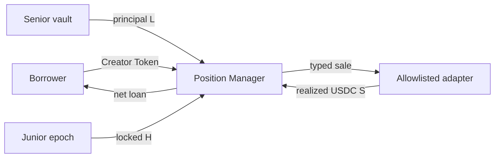

# Architecture

The non-upgradeable core separates custody and authority:

- `MuseLendPositionManager` owns per-position sale reserves and coordinates atomic state.
- `MuseLendUSDCVault` holds senior cash, ERC-4626 shares, debt shares and borrow index.
- `MuseLendHedgeEpochVault` holds non-transferable epoch shares and capped junior locks.
- `MuseLendPositionReceipt` is a non-transferable ownership receipt.
- `MuseLendRiskManager` enforces hard caps and pause state.
- `CreatorTokenValidator` and typed `ISwapAdapter` prevent arbitrary-token/call paths.

Postgres is a rebuildable cache. Contracts are authoritative for ownership, reserves,
debt and shares. No function accepts arbitrary target plus calldata.
