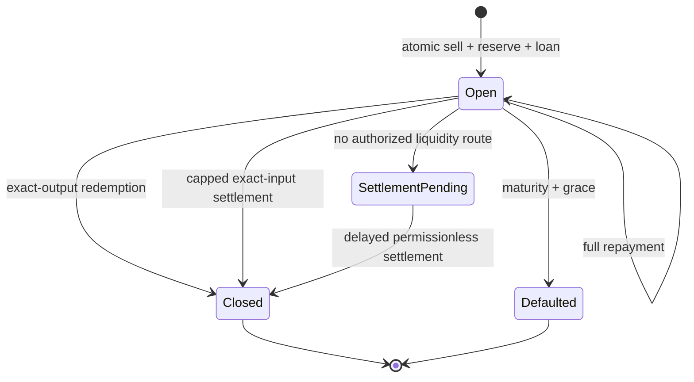
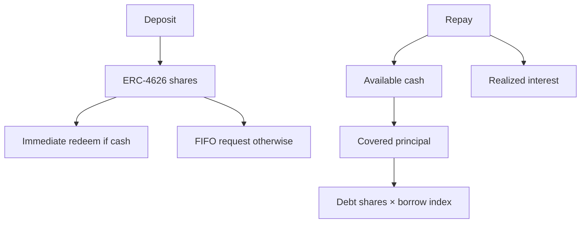
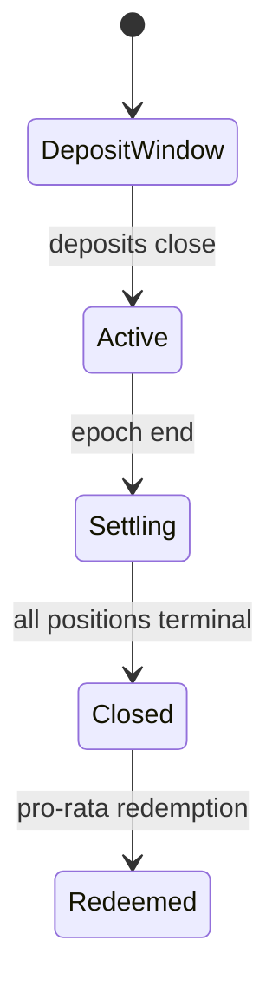

# Protocol diagrams

## Borrower state machine

```mermaid
stateDiagram-v2
  [*] --> Open: atomic sell + reserve + loan
  Open --> Open: full repayment
  Open --> Closed: exact-output redemption
  Open --> Closed: capped exact-input settlement
  Open --> Defaulted: maturity + grace
  Open --> SettlementPending: no authorized liquidity route
  SettlementPending --> Closed: delayed permissionless settlement
  Closed --> [*]
  Defaulted --> [*]
```

## Senior vault

```mermaid
flowchart TD
  Deposit --> Shares[ERC-4626 shares]
  Cash[Available cash] --> Loan[Covered principal]
  Loan --> Debt[Debt shares × borrow index]
  Repay --> Cash
  Repay --> Interest[Realized interest]
  Shares --> Immediate[Immediate redeem if cash]
  Shares --> Queue[FIFO request otherwise]
```

## Junior epoch

```mermaid
stateDiagram-v2
  [*] --> DepositWindow
  DepositWindow --> Active: deposits close
  Active --> Settling: epoch end
  Settling --> Closed: all positions terminal
  Closed --> Redeemed: pro-rata redemption
```
